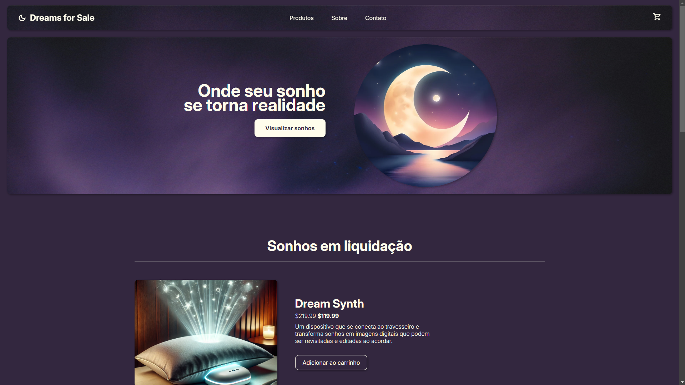

# Dreams for Sale


Bem-vindo ao repositório do **Dreams for Sale** - um portal online onde os sonhos se tornam realidade. Este site oferece uma experiência única, onde produtos fantásticos e futuristas, que vivem na imaginação, são apresentados como itens disponíveis para compra.

<a href="https://davicesarmorais.github.io/dreams-for-sale"></a>

## Índice

- [Visão Geral](#visão-geral)
- [Funcionalidades](#funcionalidades)
- [Estrutura de Pastas](#estrutura-de-pastas)
- [Tecnologias Utilizadas](#tecnologias-utilizadas)

## Visão Geral

**Dreams for Sale** é um site fictício que explora o conceito de transformar sonhos em produtos reais. Cada item no site é uma manifestação de desejos e inovações imaginárias, oferecendo uma experiência imersiva aos usuários.

## Funcionalidades

- **Navegação intuitiva:** Menu de navegação simplificado com links para as páginas de produtos, sobre e contato.
- **Produtos destacados:** Apresentação de produtos em promoção com imagens, descrições e preços.
- **Carrinho de Compras:** Funcionalidade para adicionar produtos ao carrinho.
- **Sessão Sobre:** Descrição inspiradora da missão e visão do **Dreams for Sale**.
- **Mapa de Localização:** Integração com Google Maps para mostrar a localização da loja.
- **Links para Redes Sociais:** Ícones clicáveis que redirecionam para as redes sociais da loja.

## Estrutura de Pastas

```plaintext
/
├── css /                       # Estilos (css) usados 
├── imgs/                       # Imagens usadas no site
├── pages/                      # Páginas internas
│   ├── carrinho.html
│   ├── contato.html
│   ├── produtos.html
│   ├── product/
│   │   ├── dream-synth.html
│   │   ├── flying-car.html
├── index.html                  # Página principal do site
```

## Tecnologias Utilizadas

- **HTML5:** Estruturação e semântica do site.
- **CSS3:** Estilização e layout.
- **Tailwind CSS:** Esilização e layout.
- **Google Fonts:** Integração com a fonte *Inter*.
- **Material Icons e Font Awesome:** Ícones utilizados na interface.
- **Google Maps Embed API:** Mapa embutido na seção de contato.
